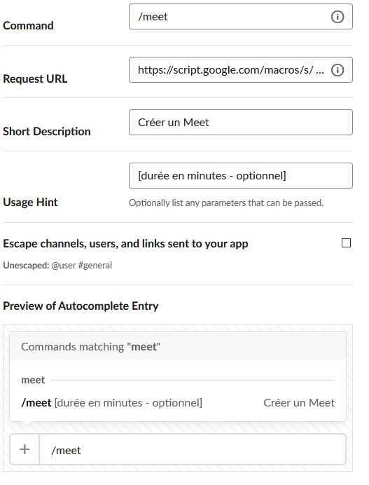
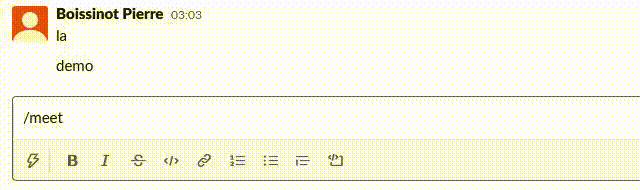

Besoin: Sur slack, je voudrais créer un google meet instantanément.

TLDR: `/meet [durée en minutes - optionnel]`

DISCLAIMER: le code est perfectible, j'ai bricolé un truc qui nous suffit mais allez plus loin si besoin.

## WHY

Il n'existe pas d'app Slack Google Meet. 

Hangout existe mais je préfère Meet.

Après quelques mois d' utilisation [au phare](https://lephare.com), nous avons apprivoisé l' outil pour de nouveaux cas d' usage tels que:
    
* Je dois me synchroniser avec X, je lui envoie un lien meet dans une conv Slack que je rejoins et où je l'attends s'il n'est pas dispo tout de suite.
* un /meet provoque une communication synchrone qui peut durer 2min au lien de 2h en asynchrone par slack interposés 
* mieux perçu par les collaborateurs qu' un call slack car moins intrusif

## Freins et contraintes

* Meet n'a pas d'API.
* Il faudrait créer une App slack avec une slash command, qui requiert une URL (endpoint) sur laquelle une requête POST est envoyée.
* Utiliser le meet de la G Suite pour ne pas s' embêter sur le hosting, la maintenance etc ...

##  Solution

Meet n'a pas d'API, mais Calendar si et bien connue, à laquelle on peut attacher une conference Meet. Il suffit ainsi de créer un event avec un Meet lié et de récupérer l'URL de ce Meet.
Google App Script a été utilisé pour le backend, connecté à la G Suite du Phare. J'ai créé un calendrier meet_calendar qui reçoit les évènements créés depuis la slash command.
Ce script est déployé en tant que web app.

Google app script:
```
// NOTES
// Slack command send post request
// Publish as public anonymous
function doPost(e) {
  Logger.log(JSON.stringify(e));
  const { postData: { contents, type } = {} } = e;
  Logger.log(type);
  const jsonData = {};
  contents
    .split("&")
    .map((input) => input.split("="))
    .forEach(([key, value]) => {
      jsonData[decodeURIComponent(key)] = decodeURIComponent(value);
    });
  Logger.log(JSON.stringify(jsonData));
  var calendarId = "VOTRE_CALENDAR_ID@group.calendar.google.com"; // dedicated meet calendar
  var start = new Date();
  // https://api.slack.com/interactivity/slash-commands
  const duration = jsonData.text.trim();
  var diff = isNumeric(duration) ? parseInt(duration) : 15; // minutes
  var end = new Date(start.getTime() + diff * 60000);
  var resource = {
    summary: "Conference Google Meet",
    location: "Remote",
    description: "An event created to get a Meet id",
    start: {
      dateTime: start.toISOString(), //'2015-05-28T17:00:00-07:00',
      timeZone: "Europe/Paris",
    },
    end: {
      dateTime: end.toISOString(), //'2015-05-28T17:00:00-07:00',
      timeZone: "Europe/Paris",
    },
    conferenceData: {
      createRequest: {
        requestId: "lph-pbo-foo", // A EDITER, là ça signifie: lph = le phare, pbo: trigramme de Pierre Boissinot
        conferenceSolution: {
          key: {
            type: "hangoutsMeet",
          },
        },
      },
      notes: "Cela ne devrait pas nous prendre plus de 15 min",
    },
  };
  var event = Calendar.Events.insert(resource, calendarId, {
    conferenceDataVersion: 1,
  });
  Logger.log(JSON.stringify(event));
  Logger.log(JSON.stringify(event.hangoutLink));
  var content = {
    response_type: "in_channel",
    text: event.hangoutLink,
  };

  return ContentService.createTextOutput(JSON.stringify(content)).setMimeType(
    ContentService.MimeType.JSON
  );
}

// https://stackoverflow.com/questions/175739/built-in-way-in-javascript-to-check-if-a-string-is-a-valid-number
function isNumeric(str) {
  if (typeof str != "string") {
    return false;
  }
  return (
    !isNaN(str) && // use type coercion to parse the _entirety_ of the string (`parseFloat` alone does not do this)...
    !isNaN(parseFloat(str))
  ); // ...and ensure strings of whitespace fail
}

```

Configuration de la slash command:



Cette commande est dispo dans les channels et DM.

## Demo


